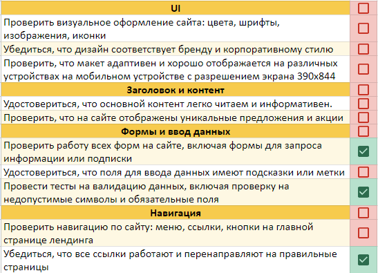

# **Тестовые артефакты**

В этом проекте ты научишься создавать тест-кейсы, чек-листы, баг-репорты, а также начнешь создание самого верхнеуровневого документа в тестировании — тест-плана.

💡 [Нажми сюда](https://new.oprosso.net/p/4cb31ec3f47a4596bc758ea1861fb624), **чтобы оставить отзыв на этот проект**. Это анонимно и поможет нашей команде «Школы 21» сделать обучение по этому проекту лучше. Рекомендуем заполнить опрос сразу после выполнения проекта.

## **Содержание**

- [Глава 1](#глава-1)
    - [Общая инструкция](#общая-инструкция)
- [Глава 2](#глава-2)
    - [Общая информация](#общая-информация)
- [Глава 3](#глава-3)
    - [Основные тестовые артефакты](#основные-тестовые-артефакты)
    - [Тест-кейс](#тест-кейс)
    - [Задание 1. Составить тест-кейс](#задание-1-составить-тест-кейс)
    - [Чек-лист и тестовый набор](#чек-лист-и-тестовый-набор)
    - [Задание 2. Составить чек-лист](#задание-2-составить-чек-лист)
    - [Баг-репорт](#баг-репорт)
    - [Задание 3. Составить баг-репорт](#задание-3-составить-баг-репорт)
    - [Тест-план](#тест-план)
    - [Задание 4. Разработка тест-плана](#задание-4-разработка-тест-плана)
- [Глава 4](#глава-4)
    - [Вспомогательные тестовые артефакты](#вспомогательные-тестовые-артефакты)
    - [Чит-лист](#чит-лист)
    - [Задание 5. Дополнить чек-лист из задания 2](#задание-5-дополнить-чек-лист-из-задания-2)
    - [Тестовые данные](#тестовые-данные)
    - [Задание 6. Тестовые данные](#задание-6-тестовые-данные)
    - [Тестовый сценарий](#тестовый-сценарий)
    - [Задание 7. Составить тестовый сценарий](#задание-7-составить-тестовый-сценарий)
    - [Сценарий использования](#сценарий-использования)

## **Глава 1** 

### **Общая инструкция** 
Как учиться в «Школе 21»: 

1. В «Школе 21» тебя ждет уникальный образовательный опыт с большим количеством свободы. Ты получаешь задачу и самостоятельно находишь информацию, чтобы ее решить. Можешь использовать все доступные средства поиска информации - ресурсы Интернета не ограничены. Но внимательно относись к источникам информации (например, если используешь нейросети): проверяй, думай, анализируй, сравнивай. 
2. Взаимообучение (Peer-to-Peer, P2P) — это обмен знаниями и опытом с другими пирами, где каждый выступает и учителем, и учеником. Такой подход позволяет глубже понять материал, учась друг у друга.  
3. Чувствуй себя свободно и проси о помощи — вокруг тебя те, кто тоже впервые проходят этот путь. Делись своим опытом и идеями с другими. Присоединяйся к RocketChat, чтобы быть в курсе всех новостей от нашего сообщества.  
4. Твое обучение не будет иметь никакого смысла, если ты будешь копировать чужие решения. Если пользуешься помощью других — всегда разбирайся до конца, почему, как и зачем. Не бойся ошибиться.   
5. Кажется, что задача невыполнима? Сделай перерыв, проветрись, перезагрузи голову — это помогало многим. Возможно, после этого решение придет само собой.  
6. Важен не только результат обучения, но и сам процесс. Нужно не просто решить задачу, а понять, КАК ее решить. 

Как работать с проектом:

1. Перед выполнением проект необходимо склонировать с GitLab в одноименный репозиторий.
2. Все файлы необходимо создавать в папке *src/* склонированного репозитория.
3. После клонирования проекта необходимо создать ветку `develop` и вести разработку в ней. После этого пушить в GitLab также нужно ветку `develop`.
4. В твоей директории не должно быть иных файлов, кроме тех, что обозначены в заданиях.

## **Глава 2**

### **Общая информация**

Работа тестировщика неразрывно связана с артефактами тестирования. Любое  планирование, выполнение или отчет о проделанной работе — это то, чем предстоит заниматься каждый день. По тестовым артефактам очень часто собирают метрики по качеству продукта, прикидывают время выполнения и оценивают тестовое покрытие. Из всего вышесказанного должно быть понятно, что это важная тема, знание которой повысит твой уровень как специалиста по тестированию.

В этом проекте ты:

- разберешься в основных тестовых артефактах и создашь их; 
- познакомишься с планом тестирования.

## **Глава 3**

### **Основные тестовые артефакты**

В ходе тестирования создаются и используются различные тестовые артефакты (например, документы, модели, дизайны, рисунки и т. д.). Наиболее распространёнными из них являются:

- **Тест-кейс** — последовательность действий, по которой можно проверить, соответствует ли тестируемая функция установленным требованиям.

- **Баг-репорт** — документ, описывающий несоответствие реальной работы программы с предъявленными к ней требованиями.

- **Чек-лист** — список необходимых проверок.

- **Тест-план** — это артефакт тестирования, описывающий действия, которые будут происходить в процессе тестирования: от разработки стратегии до критериев поиска ошибок. Он также описывает логику завершения задач и оценку рисков со сценариями их разрешения.

А теперь давай познакомимся с каждым из них подробнее! 😁

### **Тест-кейс**

**Тест-кейс** — это тестовый артефакт, суть которого заключается в выполнении некоторого количества действий и условий, необходимых для проверки определенного функционала разрабатываемого ПО.

Из чего состоит тест-кейс? 
Типичную структуру можно представить вот так:

- **ID кейса\*** (уникальный идентификатор, который может быть числовым, буквенным, буквенно-числовым). В системах управления тестированием (TMS) ID тест-кейса проставляется автоматически, исходя из его порядкового номера и проекта, в котором данный тест-кейс создаётся. Например: SM02 (SM — сокращённый код проекта, 02 — порядковый номер тест-кейса). В нашем курсе тест-кейсы нужно будет просто нумеровать.
- **Заголовок\*** — наименование тест-кейса. Не делай его большим, но по нему должно быть понятно, что и как мы тестируем.
- **Предусловия** — это условия, которые необходимы для проведения тест-кейса и выполняются ещё до его запуска.
- **Шаги\*** — это описание последовательных действий, которые необходимо выполнить для проведения теста.
- **Ожидаемый результат\*** — это то, как система должна реагировать на шаги теста.
- **Постусловия** — возможные действия по приведению системы в первоначальный вид либо «подчистка за собой» каких-то файлов, данных в базе данных и т. д.

**\*** — обязательные поля тест-кейса.

### **Задание 1. Составить тест-кейс**
1. Перейди на сайт <https://www.saucedemo.com/>  и составь тест-кейс на позитивную проверку авторизации (валидный логин и пароль).
1. Составь тест-кейс на негативную проверку (тут не ограничиваем твою фантазию авторизацией. Можно проверить UI (интерфейс), поля ввода, работу подсказок при неправильных действиях пользователя и т. д.).
1. Выполненное задание оформи в файле *task\_1.md.*

### **Чек-лист и тестовый набор**
**Чек-лист** — это список проверок, которые нужно осуществить на тестируемом ресурсе. От тест-кейса чек-лист отличается степенью подробности. 

Для использования чек-листа при тестировании нужно очень много информации держать в голове в момент прогона тестов и знать логику работы приложения (тут не расписываются сами тестовые случаи). Иными словами, чек-листы описывают кратко то, что хотим протестировать. Например:

Что лучше использовать в реальных условиях: тест-кейс или чек-лист — это вечный холивар и единого мнения до сих пор нет. У тебя при изучении данных артефактов сложится своё мнение, которое также, скорее всего, будет меняться с ростом опыта. В общем, неважно, что использовать, тест-кейсы или чек-листы — главное, чтобы функционал приложения был достаточно покрыт проверками и эти проверки были эффективными, а не существовали просто потому, что так надо.

**Тестовый набор (Test Suite)** — набор тест-кейсов, предназначенных для тестирования программы. Обычно используется для того, чтобы объединить в один набор несколько тест-кейсов, проверяющих один и тот же функционал. Его не стоит путать с чек-листом. Test Suite является обычным объединением тест-кейсов для удобства их выполнения и отслеживания.

### **Задание 2. Составить чек-лист**
1. Перейди на сайт «Школы 21» в раздел [«Как мы учим»](https://21-school.ru/methodology).
1. Так как чек-лист — это просто список проверок, то не всем, кто его читает, может быть понятно, что предусматривает тот или иной пункт проверки. Укажи в скобках краткое описание смысла проверки для каждого пункта, если название не отражает полный смысл проверки.
1. Выполненное задание оформи в файле *task\_2.md.*

### **Баг-репорт**
**Баг-репорт** описывает найденный дефект. В связи с этим актуален вопрос: что вообще является багом? Иногда объективного ответа на этот вопрос нет. При решении этого вопроса в первую очередь нужно проверить требования к ПО. Если проверка требований или имеющейся документации по проекту не дала четкого ответа на вопрос, следует подумать о баге с перспективы пользовательского опыта: если пользователю может показаться, что данное поведение системы — ошибка, скорее всего, так оно и есть. Если совсем просто, под багом мы будем понимать ошибку, когда система не соответствует заявленным требованиям.

Немного расскажем о самом важном для **некоторых** полей баг-репорта. Мы не будем сейчас перечислять все поля, а рассмотрим только те, на которых нужно заострить внимание. Остальные поля баг-репорта тебе нужно будет изучить самостоятельно, выполнив задание.

**Заголовок** — краткое описание сути бага. Заголовок следует писать, основываясь на принципе «Что? Где? Когда?»:

- **Что?** — что происходит / не происходит согласно документации / представлению о нормальной работе продукта.

- **Где?** — в каком элементе ПО возникает дефект.
- **Когда?** — при каких действиях возникает дефект.

При написании заголовка лучше избегать слов «Плохо», «Неправильно» и им подобных, так как они неточно описывают суть проблемы.

«Приоритет» проставляют в зависимости от того, как быстро найденный дефект должен быть исправлен, а «Серьёзность» — это то, насколько сильно ошибка влияет на бизнес-логику работы приложения или затрудняет использование функционала пользователями.

Не стоит путать значение полей «Приоритет» и «Серьёзность». Например, приоритетность у задачи может иметь значение `Low` (самый низкий / незначительный), а серьёзность — `Critical`. 

Если привести пример для такой комбинации, то это будет что-то похожее на «Дефект», который представляет из себя очень сильное несоответствие работы функционала бизнес-логики (серьёзность = Critical), но данная бизнес-логика на следующей неделе будет изменена или выведена из продукта (поэтому и приоритет данного дефекта = `Low`, т. к. нет смысла тратить на него время и силы).
И наоборот, приоритет может быть High, а серьёзность дефекта Trivial (подумай и попробуй представить, что это за ситуация и что это за дефект мог бы быть).

Поле «Вложения». На самом деле очень важное поле именно для тестировщика. В данном поле складываются все «доказательства» по найденному дефекту. Это могут быть снимки экрана, видеозапись поведения приложения, логи работы системы/приложения и т. д. Причин для этого минимум две:

1. Облегчить жизнь разработчику в локализации дефекта.
1. Доказательство, что «баг был», особенно актуально в случае «плавающих» багов (баг, который то есть, то его нет).

Важно помнить и знать о принципе «Один дефект — один репорт». Если на проблему уже заведен баг-репорт, второй заводить не нужно, это только создаст путаницу о количестве багов в системе. С другой стороны, если багов несколько, даже если они возникают в одном и том же окне и имеют общие черты, не стоит пытаться описать их всех одним репортом, лучше завести по репорту на каждый.

Баг-репорт — ключевой тестовый артефакт. Любой найденный баг желательно сразу оформлять и отправлять разработчику именно в формате баг-репорта. В этом проекте вряд ли удастся найти баг, однако в будущих — обязательно! 😉

### **Задание 3. Составить баг-репорт**
1. Найди дефект на ресурсе <https://www.saucedemo.com/> (на странице авторизации или после авторизации).
1. Составь баг-репорт на найденный дефект, предварительно изучив состав полей и их назначение (интернет или литература в помощь).
1. Оформи выполнение задания в файле *task\_3.md.*

### **Тест-план**
Итак, мы подобрались к главному документу в тестировании.

**Тест-план** — документ, описывающий весь объем работ по тестированию, начиная с описания тестируемых объектов, стратегии, расписания, критериев начала и окончания тестирования, и заканчивая необходимым в процессе работы оборудованием, специальными знаниями, а также оценкой рисков с вариантами их разрешения.

**Тест-план позволяет:**

- приоритизировать задачи по тестированию;
- выстроить стратегию тестирования, согласованную со всей командой;
- вести учет всех требуемых ресурсов, как технических, так и человеческих;
- планировать использование ресурсов на тестирование;
- просчитать риски, возможные при проведении тестирования.

Для тест-плана существует **ГОСТ Р 56922-2016**. Это перевод международного стандарта ISO/IEC/IEEE 29119-3:2013. В данном стандарте представлены определения и примеры, а также шаблоны тестовой документации (план тестирования, тест-кейсы, чек-листы, отчеты по тестированию). Возможно, шаблоны тест-кейсов, чек-листов, тест-плана на конкретном проекте будут отличаться от тех, что указаны в стандарте. Это нормально. Каждая организация, проект, команда адаптирует процессы, документацию и т. д. под свои потребности (что-то убирает, где-то добавляет детализации), главное — не противоречить общепринятым стандартам и понятиям.

### **Задание 4. Разработка тест-плана**
1. Разработай план тестирования для сайта «Школа 21», [раздел «Корпоративное обучение»](https://21-school.ru/corporate-training/gruppovye-intensivy-dlia-rukovoditelei-i-komand). Смысл данного задания — просто ознакомиться с теми пунктами, которые содержит тест-план. Многие пункты заполнить правильно вряд ли получится, т. к. мы еще не изучали данные темы, но понять назначение данных пунктов вполне можно.
1. Выполненное задание оформи в файле *task\_4.md.*

## **Глава 4**

### **Вспомогательные тестовые артефакты**
Кроме вышеперечисленных тестовых артефактов, ты также будешь использовать «вспомогательные» инструменты, например, «чит-лист» или генератор тестовых данных. Рассмотрим их, а также дополнительные тестовые артефакты детальнее.

### **Чит-лист**

**Чит-листом** можно считать некую «шпаргалку» по тестированию, цель которой — перечислить все возможные проверки. Функционал в различных приложениях зачастую повторяется (поля ввода логина и пароля на странице авторизации, валидация email, числовые поля и т. д.), поэтому, придумав проверки однажды, совсем необязательно вспоминать их при встрече такого же или очень схожего функционала и тем более придумывать заново.

На просторах интернета есть множество готовых чит-листов, которые могут дополнить твои проверки по уже выполненным заданиям.

### **Задание 5. Дополнить чек-лист из задания 2**
1. Найди подходящий чит-лист в интернете (должен быть ориентирован на проверку веб-страницы).
1. Скопируй проверки из файла *task\_2.md* в файл *task\_5.md* и допиши недостающие проверки в раздел «новые проверки».
1. Протестируй данную страницу по своему списку проверок и укажи напротив каждой проверки её статус (pass или fail).
1. Все найденные баги или «странности» (при наличии) записывай в этот же документ в новый раздел (название раздела на свой вкус).

### **Тестовые данные**

**Тестовые данные** — это данные, которые используются для проверки работоспособности функционала/приложения. 

Например, чтобы протестировать форму по загрузке изображений, потребуются изображения разных форматов (jpeg, png, svg и т. п.), разных размеров… И это только позитивные проверки. Если ещё учесть негативные проверки, например, попытка загрузки файлов неподдерживаемых форматов, то количество файлов резко возрастёт.

Иногда возникают сложности с подготовкой тестовых данных. Например, нужен файл не только определенного типа, но и определенного размера (веса). Можно потратить много времени на создание такого файла, если не знать о ресурсах, которые помогут автоматизировано решить эту задачу. И кстати, от полноты и качества тестовых данных зависит правильность и тестовое покрытие объекта тестирования. Ведь согласись, нельзя быть уверенным в правильности работы, например, конвертера изображений, если не проверить все заявленные форматы файлов для данного конвертера. А чтобы их проверить, нужны валидные (и не только) тестовые данные в виде этих файлов разного формата. Соответственно, когда ты получаешь задачу, в которой явно нужны тестовые данные — оцени сначала, на что должны быть направлены эти тестовые данные.

Итого, если собрать всё вышесказанное и ответить на вопрос «для чего нам нужны тестовые данные?», то получим примерно следующий ответ:

1. Для повышения эффективности и качества тестирования («правильные» тестовые данные = правильное тестирование).
1. Для экономии времени (подготовив тестовые данные однажды, можно ими пользоваться очень долго).

Теперь, когда ты знаешь о важности тестовых данных, давай посмотрим, каких видов и типов они бывают.

По видам тестовые данные могут быть ориентированы на:

- Производительность,
- Интеграцию,
- Безопасность,
- Локализацию/интернационализацию.

Также тестовые данные могут различаться по типам. Например:

- Валидные,
- Невалидные (не соответствуют требованиям либо пустые),
- Случайные,
- Нагрузочные,
- Дублирующие.

### **Задание 6. Тестовые данные**
1. Найди минимум два ресурса для генерации файлов различного размера. С помощью таких ресурсов удобно проверять функционал на ограничения по размеру загружаемого файла, что очень пригодится в будущей работе.
1. Найди ресурс для генерации тестовых данных — такие ресурсы удобны при необходимости заполнения многочисленных форм валидными данными. Как минимум ресурс должен уметь генерировать ФИО (а еще лучше + номер телефона, email, адрес).
1. Укажи ссылки на ресурсы, которые ты нашел в п. 1 и п. 2. Все найденные ресурсы должны быть рабочими, т. е. реально уметь выполнять указанную в задании функцию. 
1. Выполненное задание оформи в файле *task\_6.md.*

### **Тестовый сценарий**
**Тестовый сценарий** — набор предусловий, входных данных, действий (где это применимо), ожидаемых результатов и постусловий, разработанных на основе условий тестирования.

По определению тестовый сценарий очень похож на тест-кейс, однако различия есть. Тест-кейс рассматривает более низкоуровневые проверки, тогда как тестовый сценарий нацелен на более верхнеуровневые проверки (сквозные проверки функционала, приложения).

Для примера возьмём почтовое приложение. Тест-кейсы будут проверять поле ввода электронного адреса, область ввода сообщения, отдельные кнопки и т. п. Тестовый сценарий же будет проверять саму отправку письма.

### **Задание 7. Составить тестовый сценарий**
1. Разработай тестовый сценарий по процессу [«Как поступить в Школу 21»](https://21-school.ru/admission).
1. Выполненное задание оформи в файле *task\_7.md.*

### **Сценарий использования**
Сценарий использования или юзкейс (use case) — это сценарная техника описания взаимодействия пользователей с продуктом, которое приведет к достижению конкретной цели.

Сценарий использования описывает, кто и что может сделать с системой или что система может сделать с кем и чем.

Обычно данная техника используется для определения пользовательских, функциональных и нефункциональных требований.

Сценарий использования отвечает на вопросы:

- Кто использует функционал/приложение/сайт?
- Что хочет сделать пользователь (какое действие)?
- Цель пользователя, которую он хочет достичь за счет выполнения действия.
- Шаги, которые необходимы, чтобы совершить нужное действие.
- Описание того, как функционал/приложение/сайт должен отреагировать на действия пользователя.

💡 [Нажми сюда](https://new.oprosso.net/p/4cb31ec3f47a4596bc758ea1861fb624), **чтобы оставить отзыв на этот проект**. Это анонимно и поможет нашей команде «Школы 21» сделать обучение по этому проекту лучше. Рекомендуем заполнить опрос сразу после выполнения проекта.
