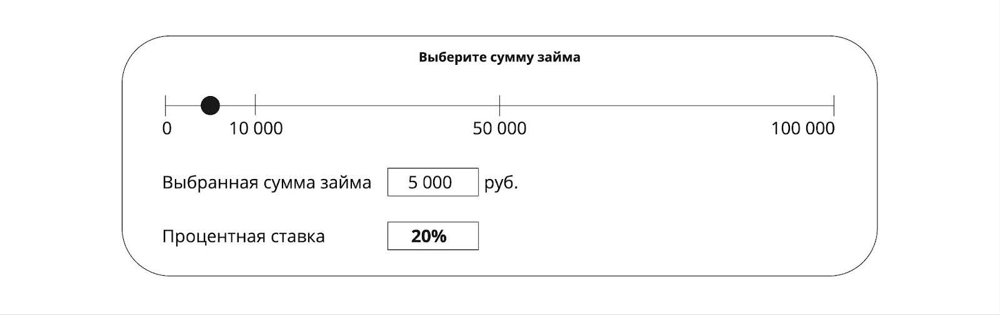
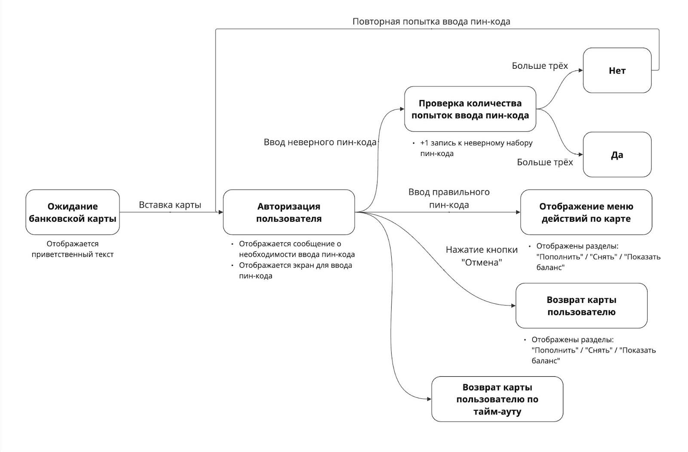

# **Тест-дизайн и тест-анализ**

В этом проекте ты научишься на практике применять основные техники тест-дизайна, составлять тестовые туры и рассчитывать тестовое покрытие.

💡 [Нажми сюда](https://new.oprosso.net/p/4cb31ec3f47a4596bc758ea1861fb624), **чтобы оставить отзыв на этот проект**. Это анонимно и поможет нашей команде «Школы 21» сделать обучение по этому проекту лучше. Рекомендуем заполнить опрос сразу после выполнения проекта.

## **Содержание**

  - [Глава 1](#глава-1)
    - [Общая инструкция](#общая-инструкция)
  - [Глава 2](#глава-2)
    - [Общая информация](#общая-информация)
  - [Глава 3](#глава-3)
    - [Тест-дизайн](#тест-дизайн)
    - [Equivalent Class Partitioning (Классы эквивалентности)](#equivalent-class-partitioning-классы-эквивалентности)
    - [Задание 1. Классы эквивалентности](#задание-1-классы-эквивалентности)
    - [Boundary Value Analysis (Анализ граничных значений)](#boundary-value-analysis-анализ-граничных-значений)
    - [Задание 2. Граничные значения](#задание-2-граничные-значения)
    - [State \& Transition Diagram (Таблица переходов и состояний)](#state--transition-diagram-таблица-переходов-и-состояний)
    - [Задание 3. Таблица переходов и состояний](#задание-3-таблица-переходов-и-состояний)
    - [Pairwise Testing (Попарное тестирование)](#pairwise-testing-попарное-тестирование)
    - [Задание 4. Попарное тестирование](#задание-4)
    - [Error Guessing (Предугадывание ошибки)](#error-guessing-предугадывание-ошибки)
    - [Тестовые туры](#тестовые-туры)
    - [Задание 5. Тестовые туры](#задание-5-тестовые-туры)
    - [Тестовое покрытие](#тестовое-покрытие)
    - [Задание 6. Матрица тестового покрытия](#задание-6-матрица-тестового-покрытия)

## **Глава 1** 

### **Общая инструкция**
Как учиться в «Школе 21»: 

1. В «Школе 21» тебя ждет уникальный образовательный опыт с большим количеством свободы. Ты получаешь задачу и самостоятельно находишь информацию, чтобы ее решить. Можешь использовать все доступные средства поиска информации - ресурсы Интернета не ограничены. Но внимательно относись к источникам информации (например, если используешь нейросети): проверяй, думай, анализируй, сравнивай. 
2. Взаимообучение (Peer-to-Peer, P2P) — это обмен знаниями и опытом с другими пирами, где каждый выступает и учителем, и учеником. Такой подход позволяет глубже понять материал, учась друг у друга.  
3. Чувствуй себя свободно и проси о помощи — вокруг тебя те, кто тоже впервые проходят этот путь. Делись своим опытом и идеями с другими. Присоединяйся к RocketChat, чтобы быть в курсе всех новостей от нашего сообщества.  
4. Твое обучение не будет иметь никакого смысла, если ты будешь копировать чужие решения. Если пользуешься помощью других — всегда разбирайся до конца, почему, как и зачем. Не бойся ошибиться.   
5. Кажется, что задача невыполнима? Сделай перерыв, проветрись, перезагрузи голову — это помогало многим. Возможно, после этого решение придет само собой.  
6. Важен не только результат обучения, но и сам процесс. Нужно не просто решить задачу, а понять, КАК ее решить. 

Как работать с проектом:

1. Перед выполнением проект необходимо склонировать с GitLab в одноименный репозиторий.
2. Все файлы необходимо создавать в папке *src/* склонированного репозитория.
3. После клонирования проекта необходимо создать ветку `develop` и вести разработку в ней. После этого пушить в GitLab также нужно ветку `develop`.
4. В твоей директории не должно быть иных файлов, кроме тех, что обозначены в заданиях.

## **Глава 2**

### **Общая информация**
Техники тест-дизайна — это то, что должен знать и уметь применять на практике любой тестировщик. Знания техник тест-дизайна необходимы для проектирования эффективных проверок функциональности. Под «эффективностью» имеется в виду достаточность тестового покрытия с наименьшими трудозатратами. Данные знания будут использоваться в работе каждый день. 

Тестовые туры помогают обнаружить неочевидные дефекты, вызванные специфичным поведением пользователя в приложении / на веб-сайте. 

Ну и, конечно, знание и умение определить тестовое покрытие поможет ответить на вопрос: «Достаточно ли сейчас проверок для текущей функциональности?» как себе, так и любому интересующемуся состоянием качества продукта.

В этом проекте ты:

- освоишь на практике наиболее часто применяемые техники тест-дизайна;
- составишь несколько тестовых туров;
- научишься рассчитывать тестовое покрытие веб-сайта/приложения.

## **Глава 3**

### **Тест-дизайн**
**Тест-дизайн** — процесс проектирования тестовой документации и того покрытия, которого хотим добиться тестовыми сценариями. 

Чаще всего времени на тестирование не будет столько, сколько хотим (а ведь хотим мы времени всегда много, т. к. чем больше времени на тестирование, тем лучше сможем протестировать и тем выше качество продукта — всё логично). Всегда есть временные рамки, в которые надо укладываться. Это еще один плюс в копилку знаний техник тест-дизайна, ведь они помогают кратно сэкономить время на тестирование, причем еще и с повышением его качества!

#### **Equivalent Class Partitioning (Классы эквивалентности)**

**Класс эквивалентности** — одно или несколько значений ввода, к которым программное обеспечение применяет одинаковую логику.

Техника анализа классов эквивалентности заключается в том, что мы анализируем диапазон возможных вводимых значений, а затем делим его на небольшие группы эквивалентных классов по своему влиянию на систему.

Разберём на примере: допустим, тебе нужно протестировать поле ввода возраста. В документации указано, что допустимые значения — целые числа от 1 до 100 включительно. Как проверить все возможные случаи? И сколько нужно проверять, если поле позволяет вводить любые символы и значения? Если подумать, то проверять можно бесконечное количество раз всё новые и новые значения. Например, проверить «1», потом «1.1», «1.01» и так далее. Понятно, что если значение «1.1» не сработает, вряд ли есть смысл проверять «1.01». Для этого и существуют классы эквивалентности — сокращаем количество необходимых тест-кейсов с бесконечности до небольшого значения. 

Например, с полем ввода возраста можно составить следующие классы эквивалентности:

Позитивная проверка: любые два числа из диапазона целых чисел от 1 до 100.

Негативные проверки:

1. числа меньше 1 (в том числе отрицательные числа);
1. числа больше 100;
1. дробные числа от 1 до 100;
1. специальные символы (# @ + — / \_  : ; “ ‘ и т. д.);
1. символы кириллицы (строчные и заглавные);
1. символы латиницы (строчные и заглавные);
1. комбинации цифр, букв и специальных символов.

Ко всем значениям из отдельного класса эквивалентности система будет применять одну и ту же логику. Рассмотрим негативную проверку №6: если указать в поле ввода два разных буквенных выражения — «aFcd» и «dcFa», то приложение отреагирует на них одинаково (попросит пользователя ввести корректное значение). 

### **Задание 1. Классы эквивалентности**

Представь себе ресурс по выдаче кредитов. На ресурсе есть поле ввода логина. По техническому заданию поле можно заполнять любыми символами (минимальное и максимальное количество символов неважно). Требуется протестировать данное поле. Что нужно сделать:

1. Определи классы эквивалентности.
1. Укажи, какими символами от каждого класса будешь тестировать.
1. Выполненное задание оформи в файле *task_1.md.*

### **Boundary Value Analysis (Анализ граничных значений)**
**Граничные значения** — значения диапазона входных данных, при которых меняется поведение приложения. Другими словами, граничные значения — это значения, в которых один класс эквивалентности переходит в другой. Проще всего понять данную технику можно на примере.

Обратимся к полю ввода возраста (см. выше) и добавим в него условие — пропускать на сайт только тех пользователей, которые старше 18 лет. Чтобы проверить работоспособность данной функциональности, можно проверить все числа от 1 до 100 и посмотреть на результат. Но это долго и неэффективно. Техника граничных значений как раз для таких ситуаций. Техника гласит: «Более 95% дефектов находятся именно на границах эквивалентных классов». Чтобы проверить границу, достаточно взять три значения: одно значение до границы, само значение границы и одно значение после границы. Важно помнить, что значения «до» и «после» границы мы берем максимально близкие к границе (исходя из принятого шага шкалы).

Граница 1: 0/1/2. \
Граница 2: 99/100/101.

Согласно технике тест-дизайна «Граничные значения», проверив данные шесть чисел, мы полностью покрыли тестами весь диапазон. 

В данной технике очень важно понимать два момента:

1. То число, которое является границей, к какой области принадлежит? В нашем случае формулировка «старше 18 лет» немного размыта, и не совсем понятно, старше на сколько? На 1 год или на 1 день? Т. е. оно может относиться как к области, в которой мы не пропускаем пользователей, так и к области, удовлетворяющей условиям для пропуска. В таких ситуациях тестировщик обязан уточнить требование, чтобы правильно выполнить проверку данной границы.
1. Какая величина шага до соседнего значения в данной шкале? Это тоже существенный фактор для проверки, т. к. нам надо взять два самых близких к границе значения. Без знания данного пункта погрешность может быть очень большой. В нашем примере это мог бы быть 1 день / 1 месяц / 1 год…

Данная техника позволяет существенно сэкономить время без потери качества, но она не применима в областях, связанных с жизнью человека, в сферах, связанных с атомной энергетикой и другими опасными сферами… В таких случаях придётся проверять каждое возможное значение.

**Мини-предупреждение:** ходят большие холивары на тему, сколько же кейсов правильно делать по технике «Граничные значения»... Два (число до границы + число самой границы) или три (число до границы + число самой границы + число после границы). Приверженцы двух чисел обосновывают данный выбор тем, что число самой границы уже проверяет класс вхождения. С этим можно согласиться, однако если тестировщик не видел код реализации данной функции (или не обладает знаниями языков программирования), то не может быть уверенным на 100% в том, что следующее число после границы отработает правильно. И второй момент: а много ли времени получится сэкономить, исключив по одному значению каждой границы? (Сколько бы этих границ не было.) Экономия сомнительная, а критичность возможного бага очень высокая. Разработчик в суете и аврале может написать код, содержащий невероятные чудеса. Это нормально, и нельзя исключать человеческий фактор. Задача тестировщика — убедиться, что в логике работы нет неожиданного или ошибочного поведения. 

### **Задание 2. Граничные значения**
После успешного тестирования поля ввода логина необходимо проверить онлайн-калькулятор. Тебе предстоит проверить расчет процентной ставки по кредиту.

Условия:

- Для выставления нужной суммы пользователь использует ползунок шкалы  величины займа (чёрный кружок).
- При займе суммы до 10 000 руб. процентная ставка = 20%.
- При займе от 10 000 до 50 000 руб. процентная ставка = 15%.
- При займе от 50 000 руб. процентная ставка = 10%.
- Максимальная сумма займа = 100 000 руб.
- Минимальный шаг шкалы калькулятора = 1 000 руб.
- Границу «0» (ноль) не тестируем.

Задание:

1. Определи граничные значения для данной функциональности.
1. Укажи, какими значениями будет протестирован калькулятор. 
1. Выполненное задание оформи в файле *task_2.md.*

### **State & Transition Diagram (Таблица переходов и состояний)**

Практически любая функциональность, находясь в одном состоянии, имеет некие триггеры для перехода в другое состояние. Увидеть все эти состояния, а также триггеры, переводящие её в другое состояние, как раз поможет данная техника «Таблица переходов и состояний».

Хорошим примером для данной техники является работа банкомата. Исходное статичное состояние — ожидание карты клиента. Предположим, что никаких других действий он в режиме ожидания не делает. Действие, которое может вывести его из данного состояния и перевести в другое — приложить или вставить карту в банкомат. Ответ банкомата на данное действие — переход на шаг авторизации клиента (ввод пин-кода карты). Тут можно уже слегка задуматься, а какие теперь действия возможны? Перечислим их все: 
1. Ввод правильного пин-кода.
2. Ввод неправильного пин-кода.
3. Отмена ввода пин-кода.
4. Тайм-аут по отсутствию действий пользователя.

На каждое действие банкомат должен отреагировать соответствующе. Удобнее всего данную технику проектировать визуально: 

На диаграмме блоки можно назвать State (состояние), а коннекторы Transition (переходы).

### **Задание 3. Таблица переходов и состояний**
1. Составь таблицу переходов и состояний для страницы авторизации <https://applicant.21-school.ru/auth>.
2. Решение оформи в файле *task\_3.md.*

### **Pairwise Testing (Попарное тестирование)**
**Попарное тестирование** — техника тест-дизайна, которая позволяет значительно сократить количество комбинаций без потери качества. Основная идея заключается в том, что дефекты, как правило, возникают, имея большое число входных параметров (их вариативности), мы можем проверить все комбинации для каждой отдельно взятой пары параметров. Проще говоря, проверять нужно не каждое значение или каждое поле по отдельности, а их комбинации, причем без повторения комбинаций! 🙂

Допустим, ты тестируешь форму публикации изображения, состоящую из трёх выпадающих списков. Перечислим значения, которые могут в себя принимать поля данной формы:

- Формат изображения: PNG/JPG/SVG.
- Цвет изображения: Чёрно-белое/Цветное.
- Размер изображения: Маленькое/Среднее/Большое.

Для проверки подобной формы нам понадобится техника попарного тестирования. Сначала выпишем все переменные и количество значений, которые они могут принимать:

1. Формат изображения (3).
2. Цвет изображения (2).
3. Размер изображения (3).

Если проверять «каждое с каждым», то число тест-кейсов у нас будет равно «3 \* 2 \* 3 = 18». 18 тест-кейсов на одну простую форму публикации — это достаточно много для трёх полей. Данный процесс можно и нужно оптимизировать, но при этом нельзя упускать никакие значения, чтобы не потерять в тестовом покрытии.

Построим таблицу:

| Формат изображения | Цвет изображения | Размер изображения |
|-|-|-|
| PNG                | Чёрно-белое      | Маленькое |
| JPG                | Цветное          | Среднее   |
| SVG                |                  | Большое   |

Комбинации данного примера можно составить вручную, но если значений будет больше, то это займет достаточно много времени по сравнению с автоматизированным способом. 

На просторах интернета можно найти разные инструменты для этого (наиболее популярен Pairwise Online Tool).

Применяя технику, получим следующие комбинации пар:

1. PNG — Цветное — Маленькое
1. PNG — Чёрно-белое — Среднее
1. PNG — Цветное — Большое
1. JPG — Цветное — Среднее
1. JPG — Цветное — Большое
1. JPG — Чёрно-белое — Маленькое
1. SVG — Чёрно-белое — Большое
1. SVG — Цветное — Маленькое
1. SVG — Цветное — Среднее

Если посмотреть на полученный результат, то можно сделать следующие выводы:

1. Комбинаций 9, а не 18.
1. Каждая пара строчки уникальная и не имеет повторений.

### **Задание 4**
Ты уже протестировал процентную ставку, осталось понять, кому выдаём кредит. Для этого просим пользователя заполнить анкету (в скобках указаны возможные варианты выбора значений):

1. Возраст (18–35/36–55/56–75).
1. Наличие любых задолженностей (да/нет).
1. Тип трудовых отношений (ИП / Самозанятый / Бессрочный договор).
1. Наличие действующих кредитов (да/нет).

Что нужно сделать:

1. Подсчитай количество всех возможных комбинаций.
1. Составь комбинации, используя технику уникальных пар.
1. Выполненное задание оформи в файле *task\_4.md.*

### **Error Guessing (Предугадывание ошибки)**

Предугадывание ошибок (то же, что и прогнозирование ошибок или предположения об ошибках) является менее популярной техникой, в отличие от предыдущих, и про неё часто все забывают. **Предугадывание ошибок (error guessing)** — это техника проектирования тест-кейсов, при которой опыт тестировщика используется для предположения того, какие дефекты могут быть в тестируемом компоненте или приложении в результате выявленных ранее ошибок, а также для разработки тестов специально для их выявления. То есть данная техника основывается по большей части на опыте самого тестировщика, из-за чего имеет свои особенности:

- Тестировщик должен обладать хорошим опытом работы с похожими приложениями (чтобы понимать, где потенциально могут быть ошибки).
- Предугадывание ошибок не заменит формальные методы, его стоит использовать как дополнение к основным техникам проектирования тест-кейсов.
- Для использования данной техники мы должны обладать достаточным набором данных о поведении и ошибках приложения в прошлом.

Для того чтобы предположить, в каких частях приложения могут возникать ошибки и где следует приложить больше усилий для тестирования, можно ответить на 3 простых вопроса:

1. Как приложение работало в прошлом? (Другими словами: «В каких частях приложения встречалось больше багов, чем в остальных?»)
2. Ошибки какого рода могут возникнуть? (Другими словами: «Какие ошибки возникали?»)
3. Какие ошибки возникали в похожих приложениях? (Другими словами: «Какие баги я находил, тестируя похожие приложения?»)

Вернёмся к примеру с полем ввода возраста. Тестируя поле ввода, ты можешь задать себе вопрос: «Встречал ли я похожую функциональность в другом приложении?» Если да, то в каком месте возникали ошибки? Например, если ты часто сталкиваешься с багами, при которых система некорректно обрабатывает отрицательные значения или значения со специальными символами, то тебе следует лучше проверить приложение на подобных входных данных.

### **Тестовые туры**

Тестовые туры — один из видов исследовательского тестирования. Типичная проблема при тестировании — это то, что тестировщик, проверяющий функциональность, один, а пользователей много. Поведение тестировщика при проверке зачастую одинаково, в то время как поведение пользователей отличается не только от тестировщика, но и друг от друга (пользователь от пользователя). Задачей тестовых туров как раз является изменить привычное поведение тестировщика. Требуемое поведение, как правило, понятно из названия тестового тура: «Путь не туда» (экспериментируем со всем, что ведет к неверному или незапланированному процессу использования приложения), «упорный пользователь» (пытаемся «на характере» войти во все недоступные места), «неуверенный пользователь» (постоянно делаем и отменяем последнее действие) и т. д.

### **Задание 5. Тестовые туры**

1. Изучи более детально тему тестовых туров (можешь использовать разные ресурсы, а также обращаться к другим пирам за рекомендациями по источникам информации об этой теме).
1. Используй свой результат работы по Заданию 2 из проекта QA2_Test artifacts («Тестовые артефакты») и продумай, какие тестовые туры можно было бы составить для проверки данного раздела (минимум 2 тура).
1. Опиши суть каждого выбранного тестового тура (в чем его особенность при выполнении тестирования).
1. Выполненное задание оформи в файле *task\_5.md.*

### **Тестовое покрытие**
Тестовое покрытие — это ключевой показатель для бизнеса, заказчиков и всех заинтересованных сторон. Чтобы ответить на вопрос: «А насколько хорошо мы покрыли тестами продукт?» — необходимо уметь рассчитывать тестовое покрытие (ведь твой ответ: «Ну… Достаточно хорошо» вряд ли будет выглядеть профессиональным и убедительным). Существуют два метода оценки тестового покрытия:

1. Тестовое покрытие кода (code coverage);
1. Матрица тестового покрытия требований (traceability matrix).

Первый метод в 90% случаев делают сами разработчики (это unit-тесты), и с помощью специальных библиотек выполняется автоматический подсчёт тестового покрытия кода. Второй метод как раз наш. В нём всё просто — составляем таблицу из двух колонок. В левой колонке перечисляем всю функциональность, которой обладает сайт/приложение. В правую колонку выписываем номера тест-кейсов/чек-листов напротив той функциональности, на проверку которой он направлен. Вот пример матрицы тестового покрытия по странице авторизации «[Школы 21](https://applicant.21-school.ru/auth)»:

| Функциональность          | Номер тест-кейса          |
|---------------------------|---------------------------|
| UI страницы               | 101, 103                  |
| **Поле «E-mail»**         | 104, 105, 106, 109        |
| **Поле «Пароль»**         | 107, 108                  |
| Кнопка локализации        | 111                       |
| **Кнопка «Войти»**        | 110, 112                  |
| **Кнопка «Регистрация»**  | 114                       |
| «Я из Узбекского кампуса» | 113, 115, 116             |
| **Забыли пароль**        | 117                       |
| Кроссплатформенность      | 118, 122, 125, 103, 126   |
| Адаптивность вёрстки      | 119, 120, 121             |

Когда матрица составлена, как понять, что что-то не так (ну или всё хорошо)? В первую очередь выделим ту функциональность, которая является наиболее критичной. Далее смотрим, сколько проверок на эту функциональность у нас есть. В нашем примере для поля «E-mail» мы видим достаточное количество проверок, в отличие от кнопки «Регистрация» и «Забыли пароль». Также, наоборот, для кроссплатформенности слишком много проверок (мы так решили для примера, что она нам не сильно важна), что неоправданно увеличивает время на тестирование.

### **Задание 6. Матрица тестового покрытия**

Вернись к проекту QA2_Test artifacts («Тестовые артефакты») и выполненному в нем Заданию 5 (дополнение чек-листа). Составь матрицу тестового покрытия для данной страницы. Проверки уже написаны, осталось только написать ту функциональность, для которой они созданы.

1. Составь таблицу по аналогии с примером выше.
1. Выдели наиболее важный функционал.
1. Пронумеруй проверки чек-листа (произвольный формат номера).
1. Выполненное задание оформи в файле *task\_6.md.*

💡 [Нажми сюда](https://new.oprosso.net/p/4cb31ec3f47a4596bc758ea1861fb624), **чтобы оставить отзыв на этот проект**. Это анонимно и поможет нашей команде «Школы 21» сделать обучение по этому проекту лучше. Рекомендуем заполнить опрос сразу после выполнения проекта.
