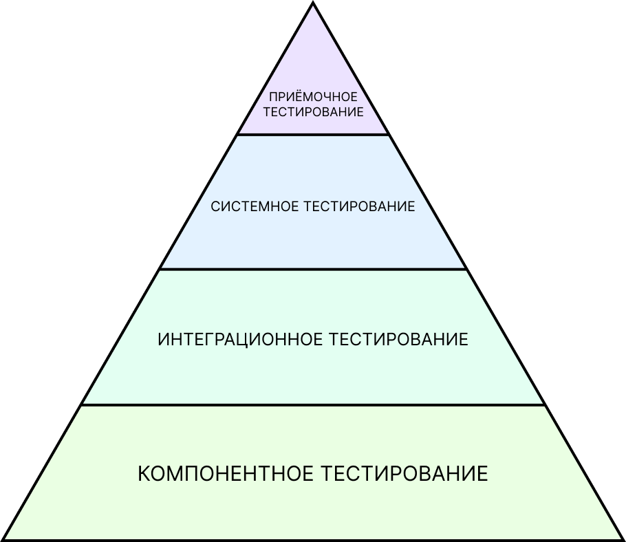
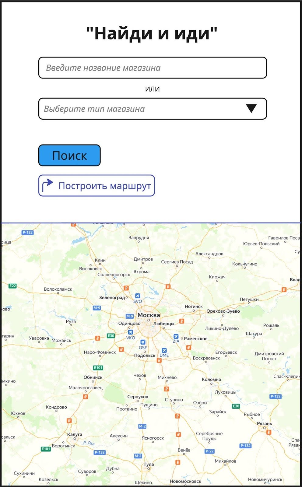

# Виды и уровни тестирования
В этом проекте ты научишься создавать чек-листы по методикам black box и grey box, а также научишься тестировать документацию.

💡 [Нажми сюда](https://new.oprosso.net/p/4cb31ec3f47a4596bc758ea1861fb624), **чтобы оставить отзыв на этот проект**. Это анонимно и поможет нашей команде «Школы 21» сделать обучение по этому проекту лучше. Рекомендуем заполнить опрос сразу после выполнения проекта.

## Содержание

  - [Глава 1](#глава-1)
    - [Общая инструкция](#общая-инструкция)
  - [Глава 2](#глава-2)
    - [Общая информация](#общая-информация)
  - [Глава 3](#глава-3)
    - [Виды тестирования](#виды-тестирования)
    - [Задание 1. Классификация тестирования](#задание-1-классификация-тестирования)
  - [Глава 4](#глава-4)
    - [Уровни тестирования](#уровни-тестирования)
    - [Задание 2. Уровни тестирования](#задание-2-уровни-тестирования)
  - [Глава 5](#глава-5)
    - [Тестирование документации](#тестирование-документации)
    - [Задание 3. Практическое тестирование документации](#задание-3-практическое-тестирование-документации)
    - [Задание 4. Black-box](#задание-4-black-box)
    - [Задание 5. Grey-box](#задание-5-grey-box)

## Глава 1
### **Общая инструкция**

Как учиться в «Школе 21»: 

1. В «Школе 21» тебя ждет уникальный образовательный опыт с большим количеством свободы. Ты получаешь задачу и самостоятельно находишь информацию, чтобы ее решить. Можешь использовать все доступные средства поиска информации - ресурсы Интернета не ограничены. Но внимательно относись к источникам информации (например, если используешь нейросети): проверяй, думай, анализируй, сравнивай. 
2. Взаимообучение (Peer-to-Peer, P2P) — это обмен знаниями и опытом с другими пирами, где каждый выступает и учителем, и учеником. Такой подход позволяет глубже понять материал, учась друг у друга.  
3. Чувствуй себя свободно и проси о помощи — вокруг тебя те, кто тоже впервые проходят этот путь. Делись своим опытом и идеями с другими. Присоединяйся к RocketChat, чтобы быть в курсе всех новостей от нашего сообщества.  
4. Твое обучение не будет иметь никакого смысла, если ты будешь копировать чужие решения. Если пользуешься помощью других — всегда разбирайся до конца, почему, как и зачем. Не бойся ошибиться.   
5. Кажется, что задача невыполнима? Сделай перерыв, проветрись, перезагрузи голову — это помогало многим. Возможно, после этого решение придет само собой.  
6. Важен не только результат обучения, но и сам процесс. Нужно не просто решить задачу, а понять, КАК ее решить. 

Как работать с проектом:

1. Перед выполнением проект необходимо склонировать с GitLab в одноименный репозиторий.
2. Все файлы необходимо создавать в папке *src/* склонированного репозитория.
3. После клонирования проекта необходимо создать ветку `develop` и вести разработку в ней. После этого пушить в GitLab также нужно ветку `develop`.
4. В твоей директории не должно быть иных файлов, кроме тех, что обозначены в заданиях.

## Глава 2
### Общая информация
Виды и уровни тестирования — важный аспект в компетенции тестировщика. Данные знания необходимы для правильного выбора подхода тестирования на каждом этапе жизненного цикла разработки ПО, помогут в расстановке приоритетов при тестировании как определенной функциональности, так и продукта целиком.

Тестирование документации — один из ранних этапов статического тестирования. Качественно проверенная документация убирает потенциальные дефекты еще до их реализации в продукте/приложении.

В этом проекте ты освоишь на практике:

- составление чек-листа по методикам Black box и Grey box;
- тестирование документации.

## Глава 3
### Виды тестирования
Сейчас в различных источниках можно найти большое количество информации о видах тестирования. Можно даже самим придумать свои виды тестирования, если продукт специфический и ничего из существующего не подошло.

Рассмотрим основные виды, которые в 90% случаев тебе так или иначе встретятся в работе. Чтобы всё категоризировать и лучше запомнить, сделаем в виде таблицы:

| По стадии проведения процесса тестирования |  По знанию устройства системы | По направленности тестового сценария | По выполнению кода |
|-|-|-|-|
| Alfa                                       | black-box                     | … | … | 
| Beta                                       | grey-box                      | … | … |
| Beta+                                      | white-box                     | … | … |

### Задание 1. Классификация тестирования
1. Дозаполни таблицу категоризации типов тестирования.
1. Выполнение задания оформи в файле *task\_1.md.*

## Глава 4
### Уровни тестирования
Существуют три уровня тестирования:

1. **Модульное** (оно же компонентное, оно же юнит-тестирование);
1. **Интеграционное**;
1. **Системное**.

И ещё один уровень добавляется по международной классификации:

1. **Приёмочное тестирование** — тестирование, проводимое при сдаче продукта заказчику. Целью приёмочного тестирования является определение готовности программного продукта к использованию конечными пользователями. Набор тест-кейсов и сценариев разрабатывается на основании требований к данному приложению.

Без завершения одного вида тестирования в пирамиде переход к более высокому уровню не имеет никакого смысла, так как каждый уровень тестирования является отдельным этапом в процессе обеспечения качества программного продукта.

### Задание 2. Уровни тестирования
1. Заполни следующую таблицу:

| Уровень тестирования | Кем проводится | На каком этапе жизненного цикла ПО | Процесс проведения |
|-|-|-|-|
| Модульное         | | | |
| Интеграционное    | | | |
| Системное         | | | |
| Приемочное        | | | |

2. Выполненное задание оформи в документе *task\_2.md.*

## Глава 5
### Тестирование документации

Итак, метод Black-box подразумевает, что мы не знаем, как работает система/приложение на уровне кода, но знаем его бизнес-логику. 
Данный метод сильно опирается на бизнес-требования, НО! Требования тоже надо тестировать.

Качественное тестирование требований на ранних стадиях (до отправки документации в работу разработчикам и дизайнерам) помогает сэкономить время многих участников команды и деньги заказчика.

Существует 4 основных критерия, на которые ориентируются при тестировании документации:

1. Полнота;
1. Однозначность;
1. Непересекаемость;
1. Атомарность.

Для примера рассмотрим отрывок плохого описания требований для почтового клиента:

«*Кнопка в нижней панели инструментов позволяет пользователю прикреплять файлы к письму, а кнопка в виде «колокольчика» позволяет включить оповещение о доставке письма*».

В данной формулировке нарушены целых 3 из 4 критериев правильности написания технического задания.

«...*прикреплять файлы к письму»* (Полнота)

1. Отсутствует информация о разрешенных типах прикрепляемых файлов.
1. Отсутствует информация о максимальном размере прикрепляемых файлов.
1. Отсутствует само описание процесса прикрепления файлов (например, при клике по кнопке откроется системное окно, в котором необходимо выбрать…).

«*Кнопка в нижней панели инструментов…»* (Однозначность)

Не указано, какая кнопка в нижней панели инструментов (их там четыре, и если исключить «колокольчик», про который явно указано, то остаются три неизвестные кнопки). Хоть интуитивно понятно, что это «скрепка», тем не менее это должно быть прописано в явном виде, и каждый, кто читает данное требование, должен одинаково понимать написанное.

«...*а кнопка в виде «колокольчика»...»* (Атомарность)

Требование для кнопки «оповещение» должно прописываться отдельно от требования для кнопки «вложение».

К тестированию документации нужно подходить очень ответственно, ведь это и первоначальный источник информации, на основе которого создается продукт, и одновременно исторические данные, к которым обращаются при уже реализованном продукте. То есть важно, чтобы документация была актуальной и полной всегда, а не только на этапе разработки продукта.

### Задание 3. Практическое тестирование документации
Приложение «Найди и иди» предназначено для поиска нужного пользователям магазина и построения маршрута до него. Для упрощения задания считаем, что геолокация всегда разрешена приложению.

Техническое задание:

|**ID требования**|**Описание требования**|
| - | - |
|SC21-01|**Поле ввода названия магазина** - Поле ввода названия магазина принимает любые символы. - Поле содержит плейсхолдер. - Плейсхолдер исчезает при вводе символов. - Минимальное количество символов — 2. - В поле сохраняются результаты предыдущих поисков.|
|SC21-02|**Поле выбора типа магазина** - Поле выбора типа магазина представляет собой выпадающее меню со следующими вариантами выбора значений: 1. «Продуктовые магазины»; 2. «Магазины стройматериалов»; 3. «Аптеки». - Поле содержит плейсхолдер «Выберите тип магазина». - При наличии выбранного значения оно отображается в поле.|
|SC21-03|**Кнопка «Поиск»** - Кнопка «Поиск» активна только в случае заполнения минимум одного поля (некликабельна при отсутствии заполнения обоих полей). - Успешные результаты поиска отображаются в виде флажков на карте. - Карту можно скроллить и зуммировать (стандартные жесты).|
|SC21-04|**Кнопка «Построить маршрут»** - Кнопка «Построить маршрут» активна в следующих случаях: 1. Найден результат поиска введенного пользователем названия магазина и выбран его флаг на карте. 2. Выбран тип магазина (маршрут будет построен до ближайшего магазина с указанным типом). - Кнопка содержит иконку в виде изогнутой стрелки,  надпись «Построить маршрут» и цвет фона #fff (белый). - При нажатии на кнопку цвет фона меняется на #586d73 (серый) и название кнопки меняется с «Построить маршрут» на «Отменить маршрут».|
|SC21-05|**Область карты** - Область карты занимает половину области экрана телефона. - Для построения маршрута требуется выполнение условий в требовании **SC21-04**. - Построенный маршрут можно отменить только нажатием кнопки «Отмена».|
|SC21-06|**Общие требования к работе приложения** - При повторном открытии приложения отображать незаконченный ранее маршрут. - Отключать точную геопозицию при низком заряде аккумулятора.|

1. Выполненное задание оформи в файле *task\_3.md.*
2. Скопируй техническое задание себе в файл (*task\_3.md*).
3. Выполни тестирование данного ТЗ.
4. Распиши, как указано в примере (про почтовый клиент), какая фраза содержит ошибку, к какому критерию эта ошибка относится и пункты пояснения, почему это ошибка.

### Задание 4. Black-box
1. Основываясь только на данном ТЗ из задания 4, напиши чек-лист проверок по методике Black-box.
1. Выполненное задание оформи в файле *task\_4.md.*

### Задание 5. Grey-box
У тебя как тестировщика данного приложения есть доступ к базам данных в которых хранится информация о магазинах. 

1. Основываясь на данных, указанных выше, напиши чек-лист проверок по методике  Grey-box.
1. Выполненное задание оформи в файле *task\_5.md.*

Полноценного задания по white-box приложения «Найди и иди» на данном этапе не будет, т. к. для этого надо уметь читать код (а тестирование «белым ящиком» и есть чтение кода).

💡 [Нажми сюда](https://new.oprosso.net/p/4cb31ec3f47a4596bc758ea1861fb624), **чтобы оставить отзыв на этот проект**. Это анонимно и поможет нашей команде «Школы 21» сделать обучение по этому проекту лучше. Рекомендуем заполнить опрос сразу после выполнения проекта.
