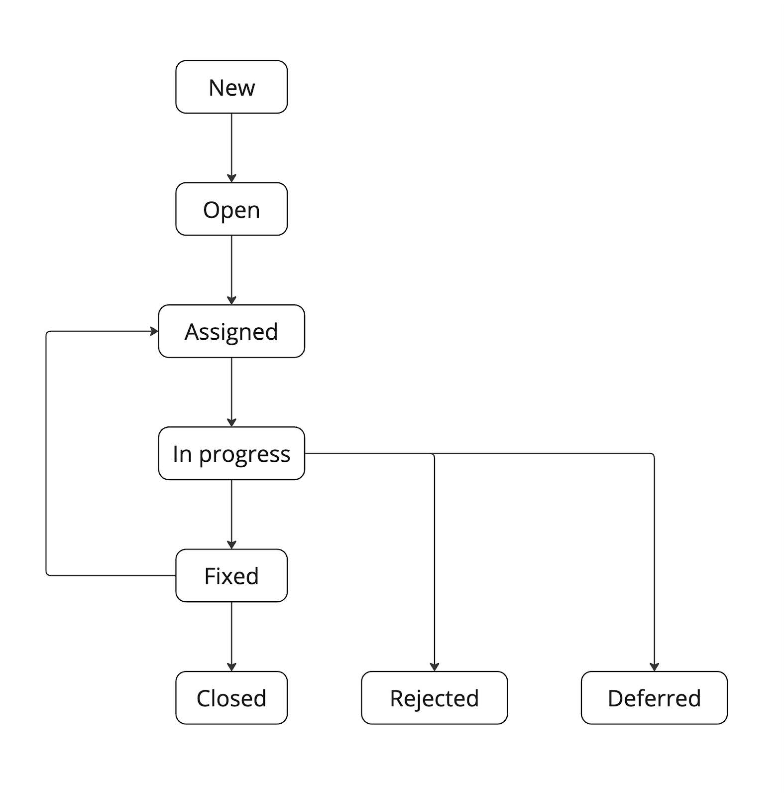

# Дефекты

В данном проекте ты на практике научишься составлять структурированные баг-репорты, узнаешь последовательность действий, которую надо сделать до заведения баг-репорта.

💡 [Нажми сюда](https://new.oprosso.net/p/4cb31ec3f47a4596bc758ea1861fb624), **чтобы оставить отзыв на этот проект**. Это анонимно и поможет нашей команде «Школы 21» сделать обучение по этому проекту лучше. Рекомендуем заполнить опрос сразу после выполнения проекта.

## Содержание

  - [Глава 1](#глава-1)
    - [Общая инструкция](#общая-инструкция)
  - [Глава 2](#глава-2)
    - [Общая информация](#общая-информация)
  - [Глава 3](#глава-3)
    - [Баг (дефект)](#баг-дефект)
  - [Глава 4](#глава-4)
    - [Виды дефектов](#виды-дефектов)
    - [Задание 1. Виды дефектов](#задание-1-виды-дефектов)
    - [Причины появления дефектов](#причины-появления-дефектов)
    - [Задание 2. Причины появления дефектов](#задание-2-причины-появления-дефектов)
    - [Локализация дефекта](#локализация-дефекта)
  - [Глава 5](#cглава-5)
    - [Баг-репорт](#баг-репорт)
    - [Задание 3. Составить баг-репорт](#задание-3-составить-баг-репорт)
    - [Жизненный цикл баг-репорта](#жизненный-цикл-баг-репорта)
    - [Задание 4. Жизненный цикл баг-репорта](#задание-4-жизненный-цикл-баг-репорта)

## Глава 1
### Общая инструкция
Как учиться в «Школе 21»: 

1. В «Школе 21» тебя ждет уникальный образовательный опыт с большим количеством свободы. Ты получаешь задачу и самостоятельно находишь информацию, чтобы ее решить. Можешь использовать все доступные средства поиска информации - ресурсы Интернета не ограничены. Но внимательно относись к источникам информации (например, если используешь нейросети): проверяй, думай, анализируй, сравнивай. 
2. Взаимообучение (Peer-to-Peer, P2P) — это обмен знаниями и опытом с другими пирами, где каждый выступает и учителем, и учеником. Такой подход позволяет глубже понять материал, учась друг у друга.  
3. Чувствуй себя свободно и проси о помощи — вокруг тебя те, кто тоже впервые проходят этот путь. Делись своим опытом и идеями с другими. Присоединяйся к RocketChat, чтобы быть в курсе всех новостей от нашего сообщества.  
4. Твое обучение не будет иметь никакого смысла, если ты будешь копировать чужие решения. Если пользуешься помощью других — всегда разбирайся до конца, почему, как и зачем. Не бойся ошибиться.   
5. Кажется, что задача невыполнима? Сделай перерыв, проветрись, перезагрузи голову — это помогало многим. Возможно, после этого решение придет само собой.  
6. Важен не только результат обучения, но и сам процесс. Нужно не просто решить задачу, а понять, КАК ее решить. 

Как работать с проектом:

1. Перед выполнением проект необходимо склонировать с GitLab в одноименный репозиторий.
2. Все файлы необходимо создавать в папке *src/* склонированного репозитория.
3. После клонирования проекта необходимо создать ветку `develop` и вести разработку в ней. После этого пушить в GitLab также нужно ветку `develop`.
4. В твоей директории не должно быть иных файлов, кроме тех, что обозначены в заданиях.

## Глава 2
### Общая информация

Оформление баг-репорта — еще одна повседневная активность тестировщика. По тому, как оформлен баг-репорт, можно многое сказать о тестировщике и даже определить его квалификацию.

В этом проекте ты разберешь назначение каждого поля баг-репорта, некоторые особенности при заполнении данных полей, а также узнаешь возможные причины появления дефектов.

Для того чтобы лучше понять и освоить процесс оформления баг-репорта, ты выполнишь практическое задание по данной теме.

## Глава 3
### Баг (дефект)

Баг (дефект) — это неожиданный/некорректный результат работы программы.

От этапа разработки, на котором будут выявлены баги, зависит очень многое. Чем раньше мы выявим баг и сообщим о нём команде, тем меньше накопится ошибок в программном коде разрабатываемого продукта, и тем быстрее мы сможем выпустить продукт в релиз.

Цена каждого найденного дефекта, пусть даже небольшого, разнится на каждой стадии жизненного цикла. Если при тестировании баг найден в документации, которую еще не отдали в работу разработчикам, то цена дефекта очень мала, так как для исправления нужно изменить всего несколько строк текста. И наоборот, когда дефект был найден пользователем — это самый дорогой баг, т. к. помимо предстоящих временных затрат, мы имеем репутационные убытки.

## Глава 4
### Виды дефектов

В зависимости от того, как «выглядят» дефекты или как «себя ведут», их можно разделить на виды. 

### Задание 1. Виды дефектов

1. Найди информацию по видам дефектов (чем больше, тем лучше).
1. Выпиши все найденные виды дефектов с их кратким описанием.
1. Выполненное задание оформи в документе *task\_1.md.*

### Причины появления дефектов

Причин возникновения дефектов достаточно много. Самой частой причиной является человеческий фактор, который может присутствовать на любом этапе жизненного цикла разработки ПО.

Перечислим несколько причин появления дефектов:

- ошибки в спецификации / техническом задании;
- ошибки при написании кода разработчиком (например, из-за слишком сложной логики функциональности, недостаточности времени для написания кода и т. д.);
- плохая коммуникация в команде;
- ошибки в инструментах разработки.

### Задание 2. Причины появления дефектов

1. Для каждого из вышеперечисленных причин появления дефектов напиши своё видение, как можно было бы его избежать/предотвратить.
1. Выполненное задание оформи в документе *task\_2.md.*

### Локализация дефекта

Отличительной чертой хорошего тестировщика является его умение локализовать дефект. То есть не просто его найти, но и показать разработчику то место в продукте, в котором (или из-за которого) возник дефект. Чем точнее тестировщик может указать причину дефекта, тем меньше времени разработчику понадобится на его устранение.

Локализация дефекта практически невозможна без инструментов тестирования/разработки. 

## Глава 5
### Баг-репорт

Прежде чем продолжить изучение баг-репорта (отчета о найденном дефекте), сначала проговорим те действия, которые надо сделать перед его созданием:

1. Повтори баг (воспроизведи его ещё раз);
1. Удостоверься в его уникальности (возможно, кто-то уже его нашел и оформил, а дубли дефектов нам не нужны 🙂);
1. Максимально локализуй его;
1. Вот теперь дефект можно оформлять (максимально подробно).

Теперь поговорим про важные составляющие для **некоторых** полей баг-репорта. Мы не будем сейчас перечислять все поля, а рассмотрим только те, на которых нужно заострить внимание. 

**Заголовок** — краткое описание сути бага. Заголовок следует писать, основываясь на принципе «Что? Где? Когда?»:

- **Что?** — что происходит / не происходит согласно документации / представлению о нормальной работе продукта.
- **Где?** — в каком элементе ПО возникает дефект.
- **Когда?** — при каких действиях возникает дефект.

При написании заголовка стоит избегать слов «Плохо», «Неправильно» и им подобных, так как они неточно описывают суть проблемы.

**«Приоритет»** проставляют в зависимости от того, как быстро найденный дефект должен быть исправлен, а **«Серьёзность»** — это то, насколько сильно ошибка влияет на бизнес-логику работы приложения или затрудняет использование функционала пользователями.

Не стоит путать значение полей «Приоритет» и «Серьёзность». Например, приоритет у дефекта может иметь значение `Low` (самый низкий / незначительный), а серьёзность — `Critical`. 
Если привести пример для такой комбинации, то это будет что-то похожее на дефект,  который представляет собой очень сильное несоответствие работы бизнес-логики (серьёзность = Critical), но данная бизнес-логика на следующей неделе будет изменена или выведена из продукта (поэтому и приоритет данного дефекта = `Low`, т. к. нет смысла тратить на него время и силы). \
И наоборот, приоритет может быть High, а серьёзность дефекта Trivial (подумай и попробуй представить, что это за ситуация и что это за дефект мог бы быть).

**Поле «Вложения».** Очень важное поле именно для тестировщика. В данном поле складываются все «доказательства» по найденному дефекту. Это могут быть снимки экрана, видеозапись поведения приложения, логи работы системы/приложения и т. д. 

Причин для этого минимум две:

1. Сэкономить время разработчику в локализации дефекта;
1. Доказательство, что «баг был», особенно актуально в случае «плавающих» багов (баг, который то есть, то нет).

Важно помнить и знать о принципе «Один дефект — один репорт». Если на проблему уже заведен баг-репорт, второй заводить не нужно, это только создаст замешательство о количестве багов в системе. С другой стороны, если багов несколько, даже если они возникают в одном и том же окне и имеют общие черты, не стоит пытаться описать их всех одним репортом, лучше завести по репорту на каждый.

Баг-репорт — ключевой тестовый артефакт. Любой найденный баг желательно сразу оформлять и отправлять разработчику именно в формате баг-репорта. В этом проекте вряд ли удастся найти баг, однако в будущих — обязательно! 😉

### Задание 3. Составить баг-репорт

1. Найди дефект на ресурсе <https://www.saucedemo.com/> (на странице авторизации или после авторизации).
1. Составь баг-репорт на найденный дефект, предварительно изучив состав полей и их назначение.
1. Выполненное задание оформи в документе *task\_3.md.*

### Жизненный цикл баг-репорта

Рассмотрим, что дальше будет с нашим оформленным и отданным в работу дефектом. Нагляднее всего это представить в виде диаграммы:

### Задание 4. Жизненный цикл баг-репорта
1. Опиши, что из себя представляет каждый этап жизненного цикла баг-репорта. А также кто и на каком этапе вправе менять статус баг-репорту. \
   Например: \
   «New» — дефект создан, но в работу ещё не отправлен (возможно, тестировщик уточняет какие-либо детали для данного дефекта). Статус выставляется автоматически. \
   «Open» — дефект открыт (отдан в очередь на исправление). Статус выставляется тестировщиком при передаче дефекта в очередь.
1. Выполненное задание оформи в документе *task\_4.md.*

💡 [Нажми сюда](https://new.oprosso.net/p/4cb31ec3f47a4596bc758ea1861fb624), **чтобы оставить отзыв на этот проект**. Это анонимно и поможет нашей команде «Школы 21» сделать обучение по этому проекту лучше. Рекомендуем заполнить опрос сразу после выполнения проекта.

